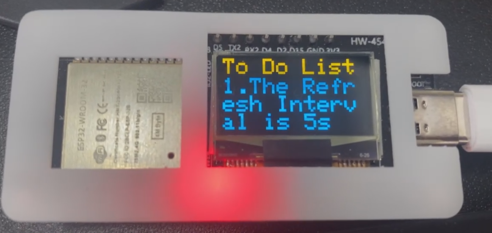

<div align=center>

# To Do List-OLED(待办事项-OLED屏)
</div> 


* *If you need more information. Please contact with caiyijiehehe@gmail.com*
* 如果你需要更多信息，请联系这个邮箱caiyijiehehe@gmail.com

<div align=center>
<div align=center>
  
   <div align=center><strong>Exapmle(例)</strong></div>
</div><br>    
</div><br>

* Notes(注):
```
1. Display screen block by block 显示屏逐块显示
2. Refresh rate is 5s 刷新率为5s
3. Enter '*' character to clear 输入*字符为清空
4. Enter '|' to block the string 输入|将字符串分块
```
